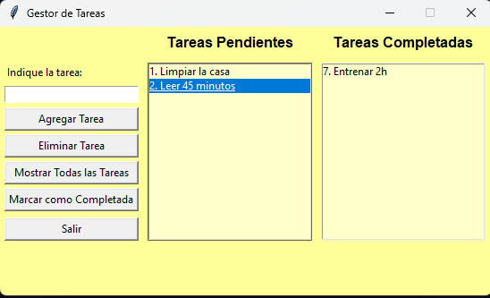

# 📝 Task Manager App

A simple task manager application written in Python using `tkinter` for the graphical user interface (GUI), `json` for handling JSON files, and `os` for interacting with the operating system. The application allows users to add, delete, mark tasks as completed, and display all tasks. Tasks are saved and loaded from a JSON file to ensure data persistence.

## ✨ Features

- **➕ Add Tasks**: Easily add new tasks with descriptions.
- **❌ Delete Tasks**: Remove tasks from the pending or completed lists.
- **✅ Mark as Completed**: Move tasks from pending to completed.
- **📋 Display All Tasks**: View all tasks in a dialog box.
- **💾Data Persistence**: Save and load tasks using a JSON file.

## 📖 Usage

1. **Add a Task**:
   - Enter the task description in the input field.
   - Press "Add Task" or hit `Enter`.

2. **Delete a Task**:
   - Select a task from the list.
   - Press "Delete Task".

3. **Mark Task as Completed**:
   - Select a task from the pending list.
   - Press "Mark as Completed".

4. **Show All Tasks**:
   - Press "Show All Tasks" to view a summary of all tasks.

## 🛠️ Classes and Methods

### `Task` Class

Represents an individual task.

- **Attributes**:
  - `id`: Unique identifier for the task.
  - `description`: Description of the task.
  - `completed`: Boolean indicating if the task is completed.

- **Methods**:
  - `mark_as_completed()`: Marks the task as completed.

### `TaskManagerApp` Class

Manages the GUI and task operations.

- **Constructor (`__init__`)**:
  - Sets up the main window and GUI elements.
  - Loads tasks from a JSON file.

- **Methods**:
  -  `add_task()`: Adds a new task.
  - `remove_task()`: Removes a selected task.
  - `mark_completed()`: Marks a selected task as completed.
  - `show_all_tasks()`: Displays all tasks in a dialog.
  - `update_lists()`: Updates the task lists in the GUI.
  - `save_tasks()`: Saves tasks to a JSON file.
  - `load_tasks()`: Loads tasks from a JSON file.
  - `on_exit()`: Saves tasks and exits the application.

## 🚀 Functionality

- **Data Persistence**: Tasks are saved to a JSON file (`tasks.json`) when the application is closed and loaded when it is reopened.
- **Error Handling**: The application handles exceptions such as invalid user input and non-existent task positions gracefully, displaying appropriate error messages.
- **Modularity**: The code is organized into classes and methods, making it modular and easy to maintain.
- **User-Friendly Interface**: The GUI allows users to interact with the application intuitively, enhancing the user experience.
- **Customizable Appearance**: Easily customize the appearance of the application by adjusting the color scheme and layout.

## 🤝 Contributing

Contributions are welcome! Please feel free to open a pull request or submit an issue if you find any bugs or have suggestions for improvements.

## 📝 License

This project is licensed under the MIT License - see the [LICENSE](LICENSE) file for details.

